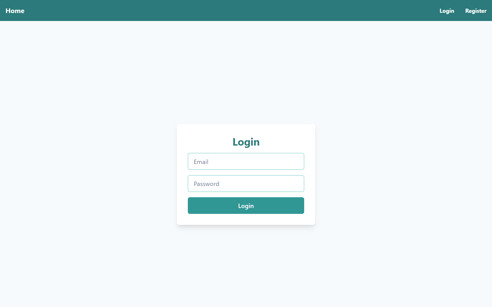
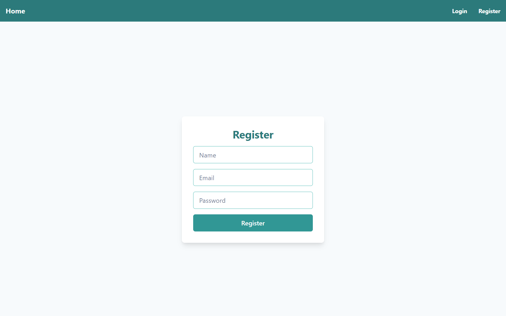
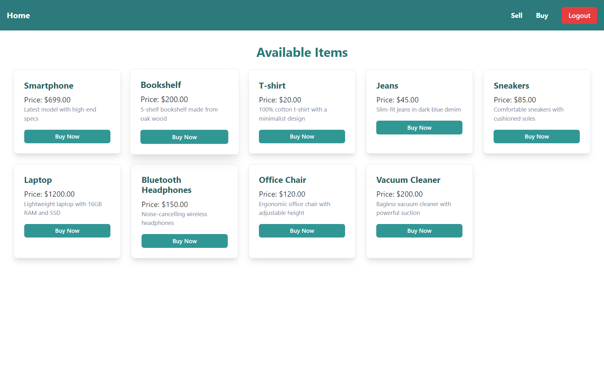
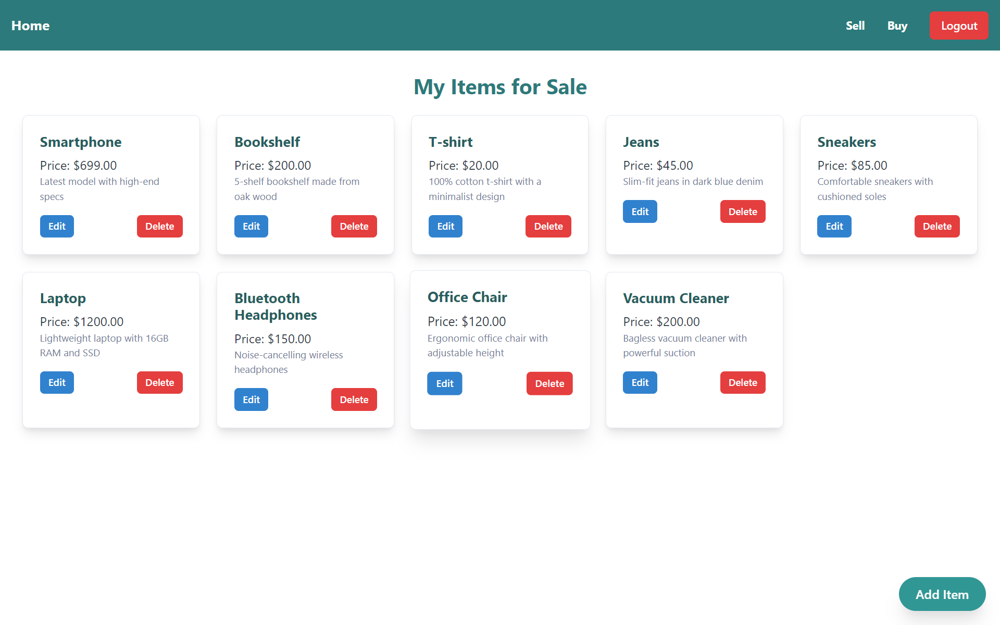
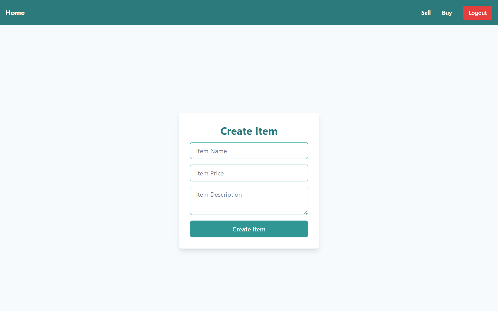
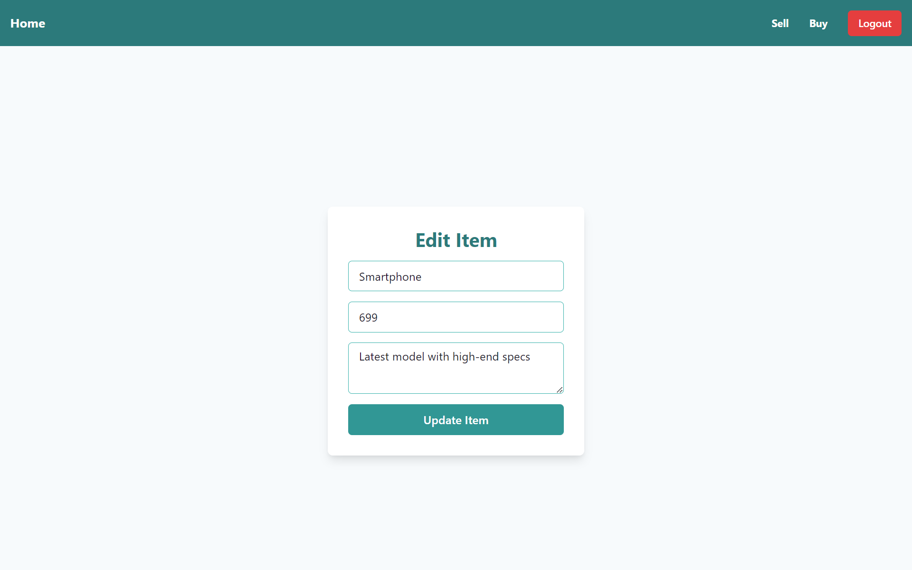
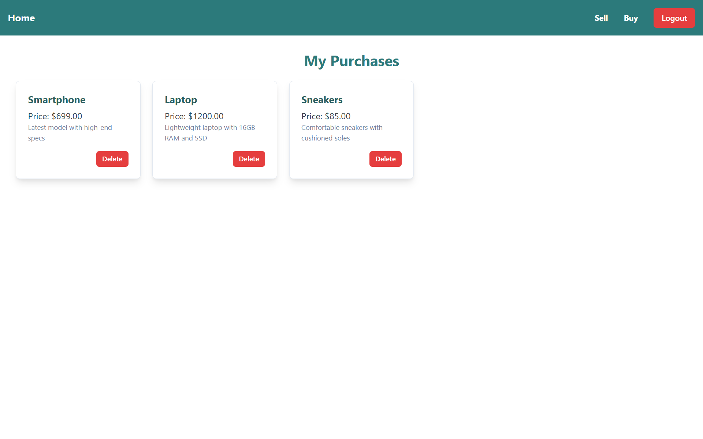

# E-Commerce Platform

## Deskripsi

E-Commerce Platform adalah aplikasi web yang memungkinkan pengguna untuk membeli dan menjual barang secara online. Pengguna dapat mendaftar, login, melihat barang yang tersedia, dan membuat transaksi pembelian. Penjual dapat mengelola barang yang mereka jual, termasuk membuat, mengedit, dan menghapus item. Aplikasi ini terdiri dari frontend yang dibangun dengan React dan ChakraUI, dan backend yang dibangun dengan Golang dan PostgreSQL.

## Fitur

- **Pengguna:**
  - Registrasi dan login
  - Melihat barang yang tersedia
  - Membeli barang
- **Penjual:**
  - Menambahkan item baru
  - Mengedit item yang ada
  - Menghapus item
- **Keamanan:**
  - Autentikasi pengguna menggunakan JWT
  - Proteksi rute untuk halaman penjual

## Prerequisites

- **Frontend:**
  - Node.js 
  - npm 
- **Backend:**
  - Golang 
  - PostgreSQL
- **Tools:**
  - Git
  - Postman 

## Instalasi

### Frontend

1. **Clone Repository**

   ```bash
   git clone https://github.com/RobertBenyamin/ecommerce-frontend.git
   cd ecommerce-frontend
   ```
2. **Instal Dependencies**

    ```bash
    npm install
    ```

3. **Konfigurasi**

    Salin file .env.example menjadi .env dan sesuaikan nilai-nilai sesuai dengan konfigurasi Anda.

4. **Jalankan Aplikasi**

    ```bash
    npm start
    ```
    Aplikasi akan berjalan pada http://localhost:3000.

## Screenshot

### Login

### Register

### Home

### My Items for Sale

### Add Item

### Edit Item

### My Purchases


## Dokumentasi Flow Interaksi Frontend dengan Backend
1. Login dan Registrasi:
    - Pengguna memasukkan email dan password pada halaman login atau registrasi.
    - Data dikirimkan ke endpoint /login atau /register.
    - Jika berhasil, backend mengirimkan token JWT yang disimpan di localStorage.

2. Melihat Barang:
    - Frontend mengirimkan request GET ke endpoint /items/.
    - Backend mengirimkan data item yang tersedia.

3. Menambahkan Barang (Penjual):
    - Penjual mengisi form untuk menambahkan item baru.
    - Data dikirimkan ke endpoint /items/ dengan metode POST.
    - Backend menyimpan item baru ke database dan mengirimkan konfirmasi.

4. Mengedit Barang (Penjual):
    - Penjual mengakses halaman edit item dengan ID item.
    - Data item dikirimkan ke endpoint /items/{id} dengan metode PUT.
    - Backend memperbarui item di database dan mengirimkan konfirmasi.

5. Menghapus Barang (Penjual):
    - Penjual mengklik tombol hapus di item yang ingin dihapus.
    - Request DELETE dikirim ke endpoint /items/{id}.
    - Backend menghapus item dari database dan mengirimkan konfirmasi.

6. Membeli Barang:
    - Pengguna mengklik tombol beli di item yang ingin dibeli.
    - Request POST dikirim ke endpoint /transactions/ dengan ID item.
    - Backend membuat transaksi baru dan mengirimkan konfirmasi.